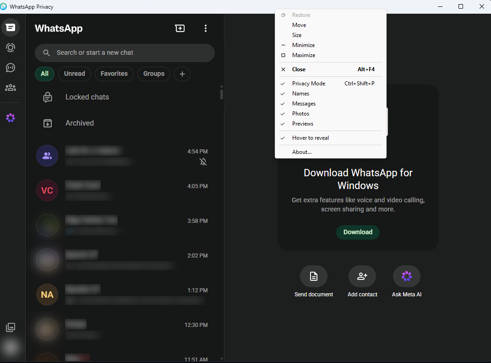

# PrivacyGlass

A native Windows app that runs WhatsApp Web with names, messages, photos and
previews **blurred by default** — so you can keep WhatsApp open on a shared or
projected screen without your chats being readable.

Everything runs locally. No server, no account, no telemetry; chat content is
never written to disk or logged. The blur is a visual layer applied to the page
after it renders — WhatsApp's own network and encryption are untouched.

## Install

1. Download `PrivacyGlass-<version>-Setup.exe` from
   [the latest release](https://github.com/sanjeevnode/privacyglass/releases/latest).
2. Run it. No admin rights needed — it installs for your user only.
3. Launch **PrivacyGlass** from the Start menu and scan the QR code once.

Windows SmartScreen may warn on first run because the installer is unsigned:
**More info → Run anyway**.

To uninstall: **Settings → Apps → Installed apps → PrivacyGlass → Uninstall**
(or Control Panel → Programs and Features). This also deletes the stored
WhatsApp session.

## How to use

Everything lives in the **window menu**: right-click the title bar, or press
**Alt+Space**.



| Item | What it does |
|---|---|
| **Privacy Mode** | Master on/off for all blurring. Also `Ctrl+Shift+P`. |
| **Names** | Contact and group names, in the list and the chat header. |
| **Messages** | Message text, link previews and document cards. |
| **Photos** | Profile pictures and avatars. |
| **Previews** | The last-message line under each chat in the list. |
| **Hover to reveal** | Point at any blurred item to read it; it re-blurs when you move away. |
| **About...** | Version and links. |

**`Ctrl+Shift+P` is the one to remember** — it toggles everything instantly and
works even when focus is inside the web view, so you can hide the screen without
reaching for the menu.

Privacy is **ON every launch**. It is applied before WhatsApp finishes rendering,
so chats are never briefly visible at startup. The four categories are independent
— for example, uncheck *Photos* alone to see who is messaging while keeping the
text hidden.

Your login persists like a normal browser, so you only scan the QR code once.

### If something stops blurring

WhatsApp changes its page structure without notice, which can make a category
stop working. Press **`Ctrl+Shift+D`** to write `diagnostics.txt` next to the
app — it lists how many elements each rule currently matches. A rule reporting
`0` is the broken one. Fixes go in [web/selectors.js](web/selectors.js), which
is the only file that needs editing when this happens.

## Build from source

```powershell
.\build.ps1
```

Output: `build\Release\PrivacyGlass.exe`

`cmake` and `nuget` are not required on PATH — the script uses the CMake bundled with
Visual Studio 2022, and CMake fetches the WebView2 SDK (a NuGet `.nupkg` is just a zip)
via `FetchContent`. The static loader is linked, so the `.exe` is self-contained.

**Requires:** VS2022 with the "Desktop development with C++" workload, and the
Microsoft Edge WebView2 Evergreen Runtime (preinstalled on current Windows 11).

`.\build.ps1 -SkipTests` skips the self-check.

## Testing

The engine has a headless self-check (26 assertions, no login or network needed):

```powershell
.\build\Release\PrivacyGlass.exe --selfcheck   # exit 0 = pass
```

Results are written to `build\Release\selfcheck.txt`. `build.ps1` and CI both
fail the build if it regresses.

Note what this does *not* cover: it runs against a mock DOM, so it verifies the
engine's logic, never that the selectors still match live WhatsApp. Use
`Ctrl+Shift+D` for that.

## Status

Working: persistent login, privacy engine with per-category control, global
hotkey, hover reveal, window-menu UI, About dialog, signed-in session caching,
and CI that publishes an installer per push.

Not done yet: settings do not persist across restarts (privacy always starts
ON with all categories enabled), and there is no tray icon, autostart, or
theme matching.

The WhatsApp session lives in `%LOCALAPPDATA%\PrivacyGlass\WebView2` and
persists like a normal browser profile. Delete that folder to log out.

## Releases

Pushing to `master` builds an installer via GitHub Actions and publishes it as
`v0.1.<run-number>`. The installer is per-user (no UAC), registers in
**Settings → Apps** for uninstall, and removes the WhatsApp session folder when
uninstalled so no chat data is left behind.

## Maintenance

WhatsApp ships obfuscated class names that change without notice. When blurring
breaks, [web/selectors.js](web/selectors.js) is the only file to edit — the CSS
keys off our own `wap-t-*` classes, never WhatsApp's.

## Disclaimer

PrivacyGlass is an independent project. It is **not affiliated with, endorsed
by, sponsored by, or connected to WhatsApp LLC or Meta Platforms, Inc.**
"WhatsApp" is a trademark of WhatsApp LLC; it is used here only to describe what
this tool works with.

PrivacyGlass does not modify, intercept, or interfere with WhatsApp's service.
It loads `web.whatsapp.com` in a standard browser engine (Microsoft Edge
WebView2) and applies a CSS blur to content already rendered on your own screen,
showing your own account's data on your own machine. No traffic is intercepted
or decrypted, no protocol is reimplemented, nothing is scraped or sent anywhere,
and no message content is ever written to disk or logged.

Your use of WhatsApp Web remains subject to WhatsApp's own Terms of Service.
Provided as-is, without warranty of any kind.

## Licence

[MIT](LICENSE)
